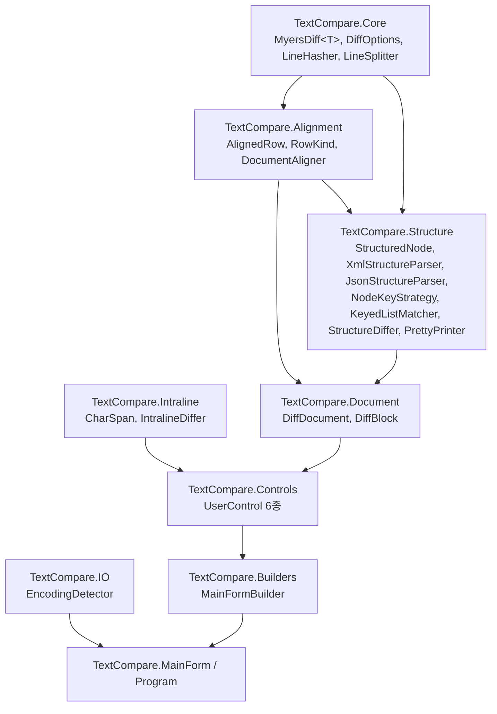

# 아키텍처

[[00-개요|← 개요로 돌아가기]]

## 레이어 구조

TextCompare는 아래로 갈수록 상위 레이어가 되는 단방향 의존 구조를 가진다. 비교 로직은 UI를 전혀 모르며, UI는 `Document` 레이어의 뷰모델(`DiffDocument`/`AlignedRow`)만 바라본다.



## 네임스페이스별 책임

| 네임스페이스 | 책임 | 주요 타입 |
|---|---|---|
| `TextCompare.Core` | 범용 diff 엔진, 정규화 옵션 | `MyersDiff<T>`, `DiffChange`, `DiffOptions`, `LineHasher`, `LineSplitter` |
| `TextCompare.Alignment` | 라인 비교 결과를 좌/우 1:1 대응 행으로 정렬 | `AlignedRow`, `RowKind`, `DocumentAligner` |
| `TextCompare.Intraline` | 변경된 라인 쌍의 문자 단위 강조 구간 계산 | `CharSpan`, `IntralineDiffer` |
| `TextCompare.Structure` | XML/JSON 파싱, 객체(트리) 단위 비교 | `StructuredNode`, `XmlStructureParser`, `JsonStructureParser`, `NodeKeyStrategy`, `KeyedListMatcher`, `StructureDiffer`, `XmlPrettyPrinter`, `JsonPrettyPrinter` |
| `TextCompare.Document` | 비교 결과 전체를 담는 뷰모델(UI가 바라보는 유일한 계층) | `DiffDocument`, `DiffBlock` |
| `TextCompare.IO` | 파일 인코딩 판별/읽기 | `EncodingDetector` |
| `TextCompare.Controls` | WinForms UserControl (Designer 패턴 준수) | `FilePickerControl`, `NavigationBarControl`, `DiffViewerControl`, `DiffPaneControl`, `LocationPaneControl`, `PreviewBarControl`, `DiffHighlighter`, `DragDropHelper` |
| `TextCompare.Builders` | Form에 UserControl을 조립하는 빌더 | `MainFormBuilder` |
| `TextCompare.Cli` | 명령줄 파싱 (WinMerge 스타일 플래그, 순수 로직) | `CommandLineOptions` |
| `TextCompare.Git` | git 연동 — 경로 변환(순수), 프로세스 실행, 임시 파일 관리 ([[09-git-연동]]) | `GitPaths`, `GitService`, `GitTempFileManager`, `GitResult` |
| `TextCompare` (루트) | 진입점, 이벤트 배선 | `Program`, `MainForm` |

## 핵심 설계 원칙: `AlignedRow`는 라인 비교와 구조 비교의 공용 계약

`TextCompare.Alignment.AlignedRow`(좌측 텍스트, 우측 텍스트, 좌/우 라인 번호, `RowKind`, diff 블록 인덱스)는 **라인 비교 결과(`DocumentAligner`)와 구조 비교 결과(`StructureDiffer`)가 동일하게 생산하는 출력 타입**이다. 그 덕분에:

- `DiffDocument.FromRows(IList<AlignedRow>)` 하나의 진입점을 두 비교 모드가 공유한다.
- `Controls` 레이어(뷰어, 미리보기, 위치 창, 하이라이트)는 입력이 라인 비교인지 구조 비교인지 전혀 알 필요가 없다 — XML/JSON 구조 비교 결과도 "예쁘게 출력된(pretty-printed) 텍스트 줄"로 변환되어 `AlignedRow`에 담기기 때문이다(`IStructurePrettyPrinter` 참고, [[03-구조적-비교-XML-JSON]]).
- 새로운 비교 모드(예: CSV, YAML)를 추가하려면 `AlignedRow` 목록을 생산하는 새 Differ만 작성하면 되고, UI 레이어는 손댈 필요가 없다.

## 빌더 패턴 (`MainFormBuilder`)

`MainForm`은 스스로 자식 컨트롤을 만들지 않는다. `MainFormBuilder`가 `TableLayoutPanel` 위에 각 UserControl을 순서 독립적으로 배치하고, 메서드 체이닝으로 조립한다:

```csharp
_builder = new MainFormBuilder(this);
_builder.AddFilePicker().AddNavigationBar().AddStatusBar().AddComparisonArea();
```

- 최상위 레이아웃은 **4행 TableLayoutPanel**(FilePicker/NavigationBar/비교 영역/상태바)을 사용한다. 각 `Add*` 메서드는 `_root.Controls.Add(control, 0, rowIndex)`로 **명시적 행 번호**에 배치하므로, 메서드 호출 순서가 바뀌어도 겹침이 발생하지 않는다.
  - 이전에는 `Dock=Top` 컨트롤을 `Controls.Add()` 순서에만 의존해 쌓았는데, 이 방식이 실제로 상단 툴바가 비교 화면 상단 줄을 가리는 버그를 일으켰다. TableLayoutPanel 전환이 이 문제의 근본적인 해결책이다.
- `MainFormBuilder`의 각 프로퍼티(`FilePicker`, `NavigationBar`, `Viewer`, `LocationPane`, `PreviewBar`, `StatusBar`)를 통해 `MainForm`이 이벤트를 배선한다(`WireEvents()`).

## WinForms Designer 패턴 준수

모든 `UserControl`(및 `MainForm`)은 표준 WinForms Designer 규칙을 따른다:

- 자식 컨트롤 필드는 `*.Designer.cs`의 partial class에 선언한다.
- 생성/속성 설정/`Controls.Add()`는 전부 `InitializeComponent()` 안에서 이루어진다.
- 이벤트는 (가능한 한) 이름이 있는 메서드로 연결한다(`this._prevButton.Click += new System.EventHandler(this.PrevButton_Click);`) — Designer가 인식할 수 있는 형태.
- 리사이즈에 따라 동적으로 재계산되는 좌표(`LayoutRightAlignedControls()` 등)나 드래그앤드롭 배선처럼 정적으로 표현할 수 없는 로직만 일반 `.cs` 파일의 생성자/메서드에 남겨둔다.

`DiffPaneControl`, `LocationPaneControl`은 자식 컨트롤 없이 전부 owner-drawn(`OnPaint`)이므로 Designer.cs에 더 옮길 요소가 없다(이미 규칙을 만족하는 상태).
