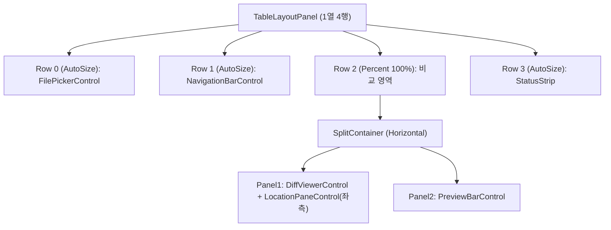

# UI 레이어

[[00-개요|← 개요로 돌아가기]]

## 화면 구성 (MainForm, TableLayoutPanel 4행)

각 행은 `RowStyle`로 서로 겹치지 않는 공간을 명시적으로 보장한다(`SizeType.AutoSize` 2개 + `SizeType.Percent(100)` 1개 + `SizeType.AutoSize` 1개). FilePicker/NavigationBar의 `Add*` 메서드는 `_root.Controls.Add(control, 0, rowIndex)`로 고정된 행 번호에 배치되므로, 호출 순서와 무관하게 겹침이 발생하지 않는다. [[01-아키텍처#빌더-패턴-mainformbuilder|배경: 이전에는 Dock 순서 의존으로 실제 겹침 버그가 있었다]].

## 주요 컨트롤

| 컨트롤 | 역할 |
|---|---|
| `FilePickerControl` | Left/Right 파일 경로 입력, 찾아보기, 대소문자/공백 무시 옵션, 비교 버튼. 드래그앤드롭 지원. |
| `NavigationBarControl` | 이전/다음 차이 이동, 차이 개수 표시, 편집 모드 토글, 저장 버튼. |
| `DiffViewerControl` | 좌/우 `DiffPaneControl` 2개 + 공용 수직/수평 스크롤바 1쌍을 합성. 편집 모드에서는 owner-drawn 페인 대신 `RichTextBox` 2개로 전환. |
| `DiffPaneControl` | 단일 페인(좌 또는 우)을 owner-drawn(가상 스크롤)으로 렌더링. 대용량 파일에서도 화면에 보이는 행만 그리므로 성능이 유지된다. |
| `LocationPaneControl` | WinMerge의 "위치 창"에 해당하는 전체 개요 맵(세로 막대, 클릭 시 해당 위치로 이동). 비교 영역 좌측에 배치. |
| `PreviewBarControl` | 현재 선택된 diff 블록의 원문을 잘림 없이 보여주는 하단 미리보기. Left=상단/Right=하단으로 배치. |
| `DiffHighlighter` | `RichTextBox`에 `AlignedRow` 기준 줄 배경색 + 문자 단위 강조색을 적용하는 공용 정적 헬퍼(`DiffViewerControl` 편집기와 `PreviewBarControl`이 공유). |
| `DragDropHelper` | 파일 드래그앤드롭 배선 공통 헬퍼. |

### 좌/우 스크롤 동기화

`DiffViewerControl`은 `VScrollBar`/`HScrollBar`를 하나씩만 가지며, `ValueChanged` 시 좌/우 `DiffPaneControl.FirstVisibleRow`(또는 `HorizontalOffset`)를 동시에 갱신한다. `AlignedRow` 정렬 덕분에 좌/우가 항상 1:1 대응이므로 스크롤바 하나로 양쪽을 동시에 제어할 수 있다.

### 위치 창 클릭 → diff 블록 이동

`LocationPaneControl.LocationClicked`는 클릭한 행 번호를 넘긴다. `MainForm`이 그 행을 포함하는 diff 블록을 찾아(`FindBlockContainingRow`) `Viewer.NavigateToBlock`을 호출하므로, 위치 창 클릭 시 하단 미리보기 패널도 함께 갱신된다.

## 편집 모드

- `SetEditMode(true)`: owner-drawn 페인을 숨기고 실제 편집 가능한 `RichTextBox` 2개(IME/캐럿/선택 영역이 OS 기본 지원)로 전환. 텍스트는 ghost 행을 제외한 실제 줄만 채운다(`GetRealRows`) — **ghost 행은 표시 전용이며 저장 파일에는 절대 포함되지 않는다.**
- 입력이 멈추면(600ms 디바운스 `Timer`) `RediffFromEditors()`가 자동으로 재비교하고 배경색을 다시 칠한다.
- `Ctrl+S` (`MainForm.ProcessCmdKey`) → `SaveChanges()` → 파일 로드 시 감지한 인코딩 그대로 `File.WriteAllText`.
- XML/JSON 구조 비교 모드에서는 편집을 지원하지 않는다 — 편집 모드 버튼은 항상 클릭 가능하게 두고, 클릭 시 안내 메시지를 띄운다(비활성화된 버튼은 클릭 이벤트 자체가 발생하지 않아 안내를 볼 수 없기 때문에 의도적으로 이렇게 설계).

## 드래그앤드롭

- **위치 인식**: `DiffViewerControl`은 `LeftFilesDropped`/`RightFilesDropped` 이벤트를 좌/우 페인에 각각 별도로 배선해, 드롭한 위치에 따라 정확히 Left/Right에 배정한다.
- **폴백**: 위치가 애매한 영역(컨트롤 배경, 스크롤바, `FilePickerControl` 전체)에 드롭하면 `FilesDropped`가 발생해 "빈 칸 우선" 배정 로직(`FilePickerControl.AcceptDroppedFiles`)이 처리한다. 2개 이상 드롭 시 좌/우에 배정 후 즉시 비교를 실행한다.

## 단축키

| 단축키 | 동작 |
|---|---|
| `Ctrl+S` | 저장 |
| `Alt+↑` | 이전 차이로 이동 |
| `Alt+↓` | 다음 차이로 이동 |

`MainForm.ProcessCmdKey`에서 전역으로 가로챈다.
