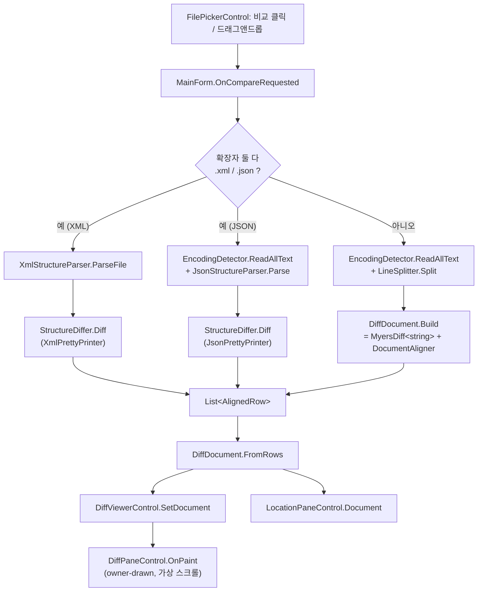
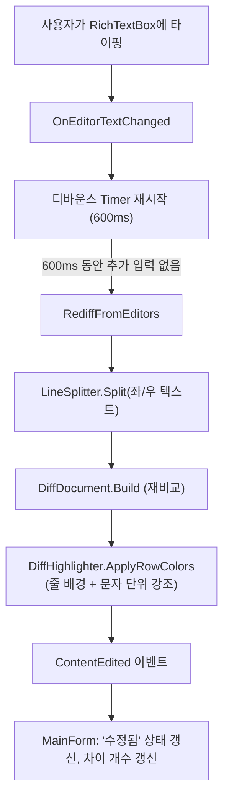
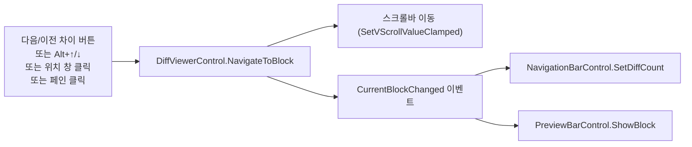

# 데이터 흐름

[[00-개요|← 개요로 돌아가기]]

## 비교 실행 흐름 (파일 로드 → 화면 렌더링)

- XML/JSON 구조 비교와 라인 비교는 **`List<AlignedRow>`를 만드는 지점까지만 다르고, 그 이후(`DiffDocument.FromRows`부터)는 완전히 동일한 경로**를 지난다.
- 인코딩: XML은 `XDocument.Load`가 XML 선언을 직접 신뢰(가장 신뢰도 높음). 그 외(JSON/텍스트)는 `EncodingDetector`가 BOM → UTF-8 엄격 검증 → CP949(EUC-KR) 순으로 판별.

## 편집 모드 재비교 흐름

편집 모드는 XML/JSON 구조 비교를 지원하지 않으므로, 이 경로는 항상 라인 비교(`DiffDocument.Build`)만 사용한다.

## diff 블록 이동/선택 흐름

## 저장 흐름

`Ctrl+S` → `MainForm.SaveChanges()` → 파일 로드 시 저장해둔 `_leftEncoding`/`_rightEncoding`으로 `File.WriteAllText(path, DiffViewerControl.LeftEditorText/RightEditorText, encoding)`. ghost 행이 저장 텍스트에 섞이지 않는 이유는 [[04-UI-레이어#편집-모드]] 참고.
