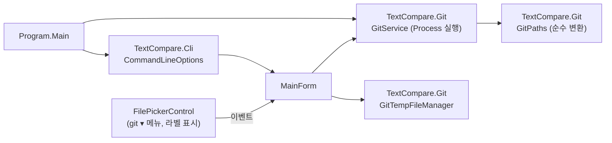
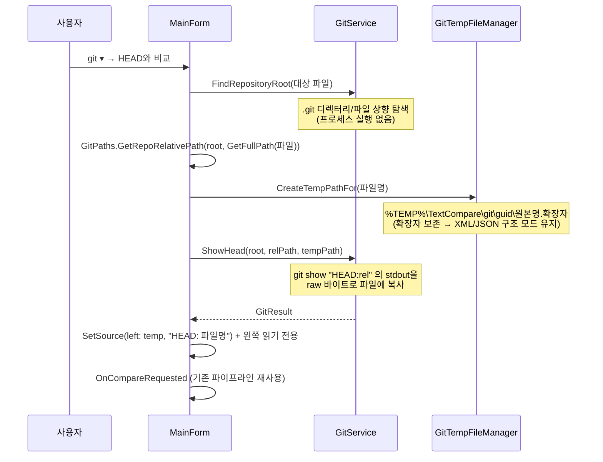

# git 연동

WinMerge의 [버전 관리 연동](https://manual.winmerge.org/en/Version_control.html)을 본떠, git과 함께 수정 내용을 검토하는 세 가지 기능을 제공한다.

1. **git difftool 외부 도구** — git이 이전 버전을 임시 파일로 만들어 본 프로그램을 호출
2. **앱 내 "HEAD와 비교"** — 프로그램이 직접 `git show`를 실행해 HEAD 버전을 추출
3. **원클릭 등록/해제** — `git config --global`에 difftool 설정을 기록/제거

## 구성 요소



| 타입 | 책임 | 비고 |
|---|---|---|
| `Cli\CommandLineOptions` | 명령줄 파싱 (순수 로직) | SelfTest 대상. WinForms 의존성 없음 |
| `Git\GitPaths` | 경로 변환·difftool cmd 문자열 생성 (순수 로직) | SelfTest 대상 |
| `Git\GitService` | git 프로세스 실행 전담 | `UseShellExecute=false`, 15초 타임아웃 |
| `Git\GitTempFileManager` | HEAD 추출용 임시 파일 수명 관리 | `IDisposable`, best-effort 정리 |

## 명령줄 문법

```
TextCompare.exe [플래그] [<left> <right>]
  /dl <label>   왼쪽 제목 라벨        /dr <label>  오른쪽 제목 라벨
  /e            Esc로 창 닫기         /u           최근 목록 제외(호환용 no-op)
  /wl           왼쪽 읽기 전용        /wr          오른쪽 읽기 전용
  /register-git   git 전역 difftool 등록 후 종료
  /unregister-git 등록 해제 후 종료
```

파싱 규칙([[01-아키텍처|아키텍처]]의 순수 로직 레이어에 위치):

- `/`·`-` 접두 모두 허용, 대소문자 무시. **알려진 플래그명과 일치할 때만** 플래그로 취급하고 나머지는 위치 인자 → 기존 2-인자 호출(`TextCompare.exe left right`)과 완전 호환.
- `/tmp/a.txt` 같은 Git Bash식 경로는 경로 구분자 존재 여부로 판별해 위치 인자로 보낸다.
- 미지의 플래그는 `Errors`에 수집하되 파싱은 계속한다(WinMerge식 관용).
- 종료 코드: 0=차이 없음, 1=차이 있음, 2=오류. `ApplyCompareResult`에서 `Environment.ExitCode`로 설정하며 git의 `difftool.trustExitCode`와 호환.

## difftool 등록이 기록하는 설정

`GitService.RegisterAsDifftool`은 `git config --global`을 3회 호출한다(재실행 시 같은 값을 덮어써 멱등):

```ini
[diff]
    tool = textcompare
[difftool "textcompare"]
    cmd = "C:/.../TextCompare.exe" /dl "이전 버전" /dr "작업본" /wl /u /e "$LOCAL" "$REMOTE"
[difftool]
    prompt = false
```

설계상 주의점:

- `$LOCAL`/`$REMOTE`는 **리터럴로 저장**한다 — git의 sh가 실행 시점에 임시 파일 경로로 확장한다.
- exe 경로는 forward slash로 변환한다(`GitPaths.BuildDifftoolCmdValue`) — sh가 백슬래시를 이스케이프로 해석하는 문제 회피. 경로에 `$`나 `"`가 포함된 exe는 지원하지 않는다.
- `$LOCAL`(이전 버전)은 git이 만든 임시 파일이므로 `/wl`로 편집을 차단한다 — 편집해도 저장할 곳이 없다.
- 해제(`UnregisterDifftool`)는 `diff.tool`의 현재 값이 `textcompare`일 때만 지워서 **다른 도구 설정을 보호**하고, `difftool.textcompare` 섹션은 통째로 제거한다.

## 앱 내 "HEAD와 비교" 흐름

`FilePickerControl`의 `git ▾` 드롭다운 → `GitCompareWithHeadRequested` 이벤트 → `MainForm.OnGitCompareWithHeadRequested`:



설계 결정:

- **대상 파일 선택**: Right 칸의 파일 우선(존재 시), 없으면 Left — 작업본은 항상 **오른쪽**에 놓인다(As-Is/To-Be 관례와 일치).
- **raw 바이트 추출**: `git show`의 stdout을 텍스트로 읽으면 인코딩이 훼손되므로 `StandardOutput.BaseStream.CopyTo(FileStream)`으로 바이트를 그대로 저장한다. 이후 기존 `EncodingDetector`([[05-데이터-흐름]])가 BOM/CP949 등을 원본대로 감지한다. 커밋 시 `core.autocrlf`로 CRLF→LF 정규화된 blob이 나올 수 있으나 `LineSplitter`가 모든 개행을 처리하므로 문제없다.
- **경로 정규화**: 비교·상대경로 계산 전에 반드시 `Path.GetFullPath`로 정규화한다. 8.3 단축 경로(`C:\Users\A12920~1\...`)가 섞이면 접두 검사가 실패하고, relPath가 비면 `git show "HEAD:"`가 트리 목록을 **성공(exit 0)으로** 출력해 오류가 숨는다.
- **임시 파일 수명**: 새 임시 파일 생성 시 이전 것을 삭제하고, `MainForm.FormClosed`에서 `Dispose()`로 전부 정리한다. 생성자에서 7일 지난 잔재(비정상 종료분)를 청소한다. 모든 삭제는 best-effort(백신 잠금 등으로 실패해도 무시).

## 오류 처리 매트릭스

| 상황 | 감지 방법 | 사용자 메시지 |
|---|---|---|
| git 미설치/PATH 없음 | `Process.Start`의 `Win32Exception` → `GitNotFound` | "git이 설치되어 있지 않거나 PATH에서 찾을 수 없습니다." |
| 저장소 아님 | `FindRepositoryRoot` null | "이 파일은 git 저장소 안에 있지 않습니다." |
| 미커밋(미추적) 파일 | exit 128 + stderr `exists on disk, but not in` / `does not exist` | "이 파일은 아직 커밋된 적이 없어 HEAD 버전이 없습니다." |
| 빈 저장소(커밋 없음) | exit 128 + stderr `bad revision` / `unknown revision` | "이 저장소에는 아직 커밋이 없습니다." |
| 응답 없음 | `WaitForExit(15초)` 실패 → Kill | "git 응답이 없어 중단했습니다." |
| 기타 | non-zero exit | stderr 앞 300자 포함 일반 오류 안내 |

## 읽기 전용(/wl, /wr)의 적용 지점

- `DiffViewerControl.SetPaneReadOnly` → 편집 모드의 `RichTextBox.ReadOnly` + 배경 틴트(시각 단서). 비교 보기(owner-drawn 페인)는 원래 편집 불가이므로 추가 조치 불필요([[04-UI-레이어]]).
- `MainForm.SaveChanges` → 읽기 전용 쪽은 `File.WriteAllText` 생략 + 상태바 안내. 양쪽 다 읽기 전용이면 저장 자체를 거부.
- 라벨 표시 모드가 해제되면(사용자가 직접 다른 파일 지정) 읽기 전용도 CLI 기본값으로 복원된다(`OnCompareRequested`).
- XML/JSON 구조 비교는 편집 자체가 차단되어 있어 `/wl`이 자연히 no-op.

## 테스트

- **SelfTest**: `RunCommandLineTests`(파서 호환성·플래그 조합·오류 수집), `RunGitPathTests`(상대 경로 계산·`BuildDifftoolCmdValue` 형식 고정) — [[06-빌드-및-테스트]] 참고. `GitService`/`GitTempFileManager`는 프로세스·파일시스템 의존이라 SelfTest 프로젝트에 링크하지 않는다.
- **수동 E2E**: 실제 저장소에서 `git ▾ → HEAD와 비교`, `/register-git` 후 `git difftool` 실행, CP949·UTF-8 BOM 파일 인코딩 보존, `.xml` 구조 모드 유지 확인.
